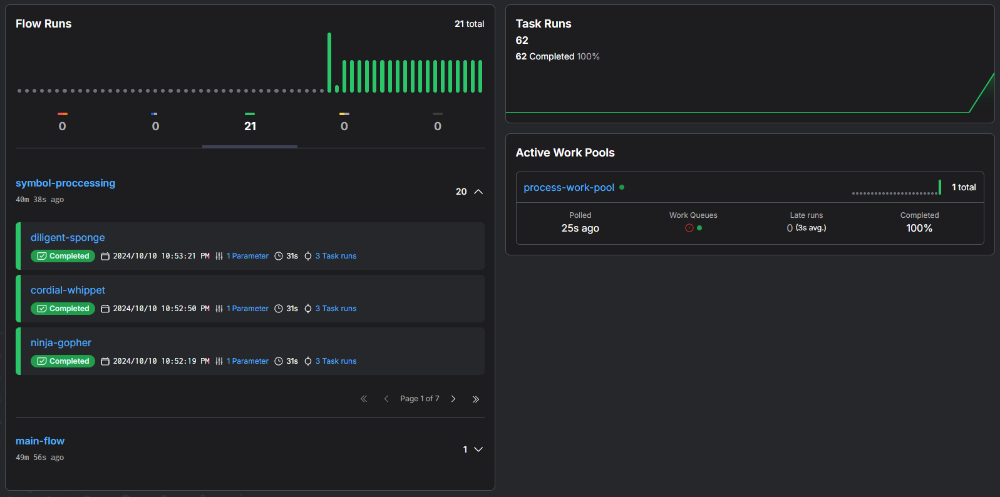
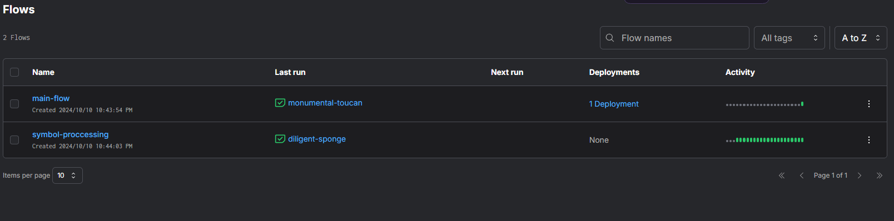
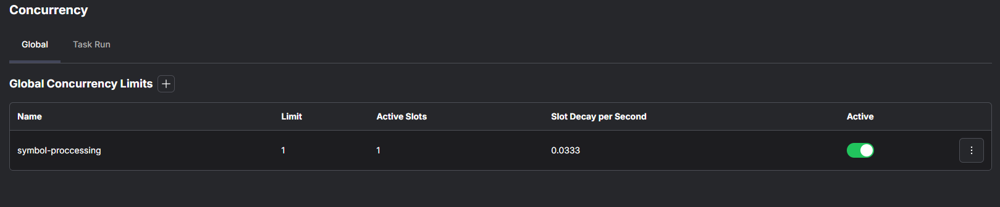
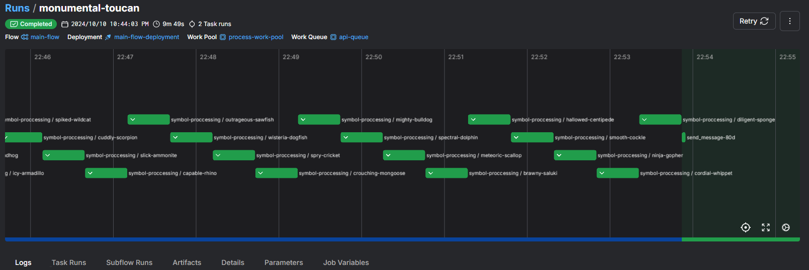

## Система обработки данных с использованием [Prefect 3.0](https://github.com/PrefectHQ/prefect)

### Выполняет следующие шаги:

1. Загружает данные из CSV-файла.
2. Для каждой строки CSV-файла выполняет запрос к стороннему API.
3. Обрабатывает полученные данные с использованием pandas.
4. Сохраняет результаты в виде JSON-файлов в локальную файловую систему.
5. Отправляет уведомление о завершении в Telegram чат.

## Использование

1) ### Измените данные для Телеграм-бота в файле .env на ваши

2) ### Запустите создание [Docker](https://github.com/docker) контейнера:

```sh
docker build -t my-docker-image:dev . 
```

3) ### Запустите контейнер:

```sh
docker run -p 4200:4200 --memory="512m" --cpus="1" my-docker-image:dev
```

Параметры *--memory*, *--cpus* отвечают за ограничение на использование ресурсов

### Перейдите по адресу http://localhost:4200/dashboard

## Как работает:

### В Dockerfile происходит запуск bash-скриптов:

```sh
prefect server start --host 0.0.0.0 &
prefect config set PREFECT_API_URL=http://127.0.0.1:4200/api
prefect server database reset -y
```

#### Отвечают за запуск Prefect UI

```sh
prefect work-pool create "process-work-pool" --type "process"

prefect work-pool set-concurrency-limit "process-work-pool" 1
```

#### Создается work pool с типом *process*, в него добавляется параметр *set-concurrency-limit*, отвечающий за максимальное количество запусков потока, которые вы хотите запустить одновременно в work pool

```sh
prefect gcl create "symbol-proccessing" --limit 1 --slot-decay-per-second 0.0333
```

#### Создается новое глобальное ограничение параллелизма
#### *--slot-decay-per-second* используется в Prefect для управления скоростью освобождения слотов
В нашем случае 1 задача каждые 30 секунд

```sh
prefect work-queue create "api-queue" --limit 1 --pool "process-work-pool"
```

#### Создаем систему очередей для ограничения одновременных запросов к API

```sh 
python main.py
```

#### Вызов main.py, в котором происходит деплой 

#### main.py:

```python
if __name__ == "__main__":
    main_flow.from_source(
        source=".",
        entrypoint="main.py:main_flow"
    ).deploy(
        name="main-flow-deployment",
        work_pool_name="process-work-pool",
        work_queue_name="api-queue",
    )
```

#### В *from_source* указывается откуда берется код и его энтрипоинт
#### *deploy* отвечает за деплой, где *name* - имя деплоя, *work_pool_name* - созданный ранее пул воркеров, *work_queue_name* - созданная ранее система очередей

```sh 
prefect deployment run 'main-flow/main-flow-deployment'

prefect worker start -p "process-work-pool" -q "api-queue" --limit 1
```

#### Запуск созданного деплоя и воркера, с параметром *--limit*, который отвечает за максимальное количество запусков потока для одновременного запуска

## Пример Docker файла и bash-скриптов:
```dockerfile
FROM python:3.10

RUN apt update && apt install -y curl build-essential libpq-dev sqlite3

RUN pip install --no-cache-dir prefect pandas requests

WORKDIR /app
COPY . .
COPY .env /app/.env
RUN pip install -r requirements.txt

COPY init_prefect.sh /app/init_prefect.sh

RUN chmod a+x /app/*.sh

CMD ["/bin/bash", "-c", "/app/init_prefect.sh"]

```
```sh 
#!/bin/bash

mkdir -p /app/prefect_data

echo "Starting Prefect Server"
prefect server start --host 0.0.0.0 &
prefect config set PREFECT_API_URL=http://127.0.0.1:4200/api
prefect server database reset -y

sleep 10

echo "Creating work pool, work queue, and worker..."

prefect work-pool create "process-work-pool" --type "process"

prefect work-pool set-concurrency-limit "process-work-pool" 1

prefect gcl create "symbol-proccessing" --limit 1 --slot-decay-per-second 0.0333

prefect work-queue create "api-queue" --limit 1 --pool "process-work-pool"

python main.py

sleep 5

prefect deployment run 'main-flow/main-flow-deployment'

prefect worker start -p "process-work-pool" -q "api-queue" --limit 1

```

## Пример работы системы:
#### Для примера использовались первые 20 записей






### Логи запуска, где можно увидеть ограничение в 30 секунд
[monumental-toucan.csv](monumental-toucan.csv)